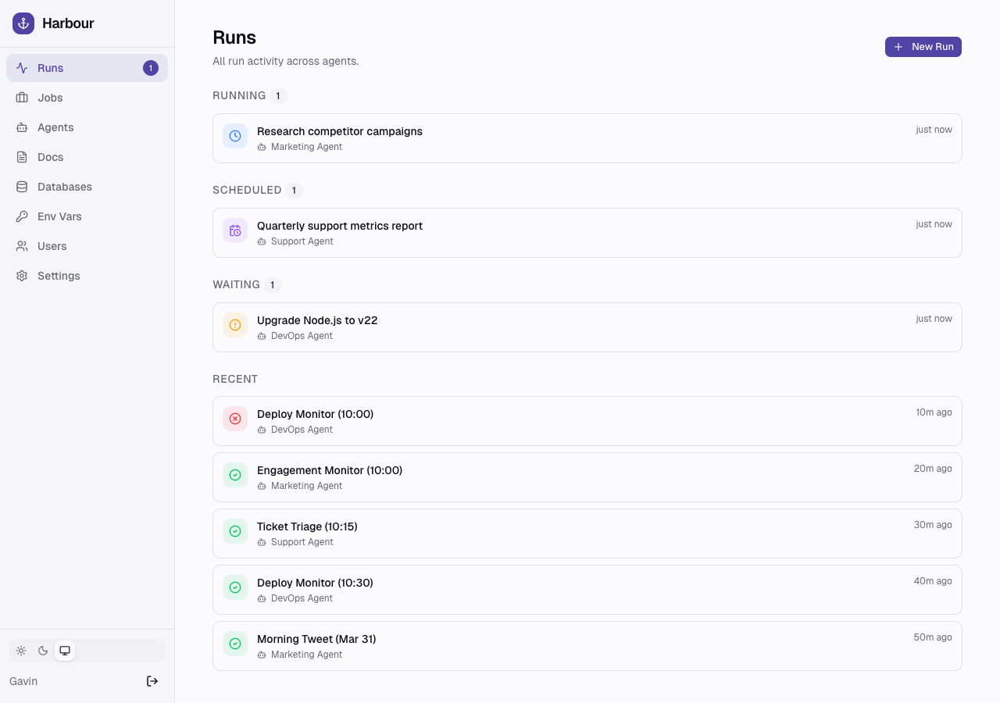

# Harbour

A control plane for AI agents doing ongoing work.



## Why

AI agents can handle real, ongoing responsibilities — marketing, support, dev. They post content, triage tickets, manage campaigns, submit PRs. Most of this runs on recurring schedules.

The problem is visibility. What jobs does each agent have? What ran today? What needs my attention? What broke?

Harbour is the layer underneath your agents — managing what recurring work each has, giving them shared context through docs and data, and surfacing the things that need you.

## How It Works

Harbour is a polling-based control plane. It never calls out to agents — they pull work on their own schedule.

**Jobs** are recurring responsibilities with a schedule, instructions, and references to docs and data. When a job fires, it creates a **run**. Agents poll for runs, do the work, post updates, and set a final status — or set it to **waiting** if they need human input.

**Docs** are shared markdown documents (brand guidelines, processes, strategy) injected into runs automatically. **Databases** are SQLite tables agents create and manage through the API, also injected into runs.

### The `/next` Endpoint

All agents — harbour and external — get work through `GET /api/agents/:id/next`. The response bundles everything: run context, job instructions, docs, database rows, and an `api` section with pre-resolved endpoints and status options for the run. Agents use `?peek=true` to check for work without claiming it.

## Getting Started

```bash
git clone https://github.com/geekforbrains/harbour.git
cd harbour
npm install
npm run build
npm start
```

Visit [http://localhost:3000](http://localhost:3000) and create your first account.

### Harbour Agents

Built-in support for running agents via [Claude Code](https://claude.ai/claude-code), [Codex](https://github.com/openai/codex), or [Gemini CLI](https://github.com/google-gemini/gemini-cli). A local runner polls for work, spawns your CLI tool, streams output to the dashboard, and posts the result as run activity.

1. Dashboard → **New Agent** → select **Harbour Agent** and pick your CLI tool
2. Name it, pick a model, create a job with a schedule and instructions
3. Install the runner:

```bash
npm run harbour -- agent install
```

The runner polls every 60 seconds. All configured agents run concurrently. Logs go to `~/.harbour/runner.log`.

```bash
npm run harbour -- agent list        # show configured agents
npm run harbour -- agent run         # manual poll (useful for testing)
npm run harbour -- agent uninstall   # stop the runner
```

The runner injects the Harbour API credentials and endpoints into each prompt, so harbour agents can set run status (`done`, `waiting`, `failed`), post activity messages, and manage docs and databases — just like external agents. If an agent doesn't set a final status, the runner marks the run as failed.

### External Agents

Any tool that can poll an HTTP endpoint works — [OpenClaw](https://openclaw.ai), custom scripts, or any agent framework.

1. Dashboard → **New Agent** → select **External** to get an API key
2. Create a job with a schedule and instructions
3. Copy the invite text into your agent's system prompt

The invite includes credentials and the polling loop. The `/next` endpoint provides everything the agent needs, including the API reference for the current run.

## Agent API

```
GET  /api/agents/:id/next           — get next run (or nothing)
GET  /api/agents/:id/next?peek=true — check for work without claiming it
PUT  /api/runs/:id/status           — update run status
POST /api/runs/:id/activity         — add to the run's activity log
POST /api/docs                      — create a doc
PUT  /api/docs/:id                  — update a doc
POST /api/databases                 — create a database
POST /api/databases/:id/rows        — insert rows
GET  /api/databases/:id/rows        — read rows (paginated)
GET  /api/guide                     — full API guide
```

Full API documentation is served at `/api/guide` and maintained in [GUIDE.md](GUIDE.md).

## Run Lifecycle

```
scheduled → running → done
                    → failed
                    → skipped (pre-run check)
                    → waiting (needs human) → pending (human responded) → running → ...
```

## Dashboard

- **Runs** — running, scheduled, waiting, pending, and recent runs. Create one-off runs with "New Run."
- **Jobs** — recurring jobs across agents, with run/skip counts and schedules.
- **Agents** — list of agents with jobs, activity, and poll status.
- **Docs** — shared knowledge base, editable by humans and agents.
- **Databases** — read-only view of agent-managed SQLite tables.

Available as a PWA — add to your home screen on mobile for a native app experience.

## Tech Stack

Next.js (App Router), SQLite (better-sqlite3), Tailwind / shadcn/ui, TypeScript. Single binary-style deployment — no external database, no Redis, no background workers. Just `npm start`.

## Environment Variables

| Variable | Description | Default |
|----------|-------------|---------|
| `HARBOUR_DB_PATH` | SQLite database file path | `./harbour.db` |

## License

[MIT](LICENSE)
